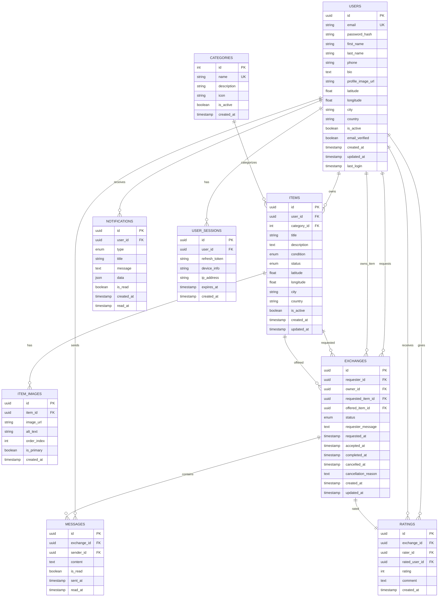

# Diseño de Base de Datos - Trueque Verde 2.0

## Diagrama de Entidad-Relación



## Esquemas de Tablas

### 1. Tabla USERS

```sql
CREATE TABLE users (
    id UUID PRIMARY KEY DEFAULT gen_random_uuid(),
    email VARCHAR(255) UNIQUE NOT NULL,
    password_hash VARCHAR(255) NOT NULL,
    first_name VARCHAR(100) NOT NULL,
    last_name VARCHAR(100) NOT NULL,
    phone VARCHAR(20),
    bio TEXT,
    profile_image_url VARCHAR(500),
    latitude DECIMAL(10, 8),
    longitude DECIMAL(11, 8),
    city VARCHAR(100),
    country VARCHAR(100),
    is_active BOOLEAN DEFAULT true,
    email_verified BOOLEAN DEFAULT false,
    created_at TIMESTAMP WITH TIME ZONE DEFAULT CURRENT_TIMESTAMP,
    updated_at TIMESTAMP WITH TIME ZONE DEFAULT CURRENT_TIMESTAMP,
    last_login TIMESTAMP WITH TIME ZONE
);

CREATE INDEX idx_users_email ON users(email);
CREATE INDEX idx_users_location ON users(latitude, longitude);
CREATE INDEX idx_users_city ON users(city);
```

### 2. Tabla CATEGORIES

```sql
CREATE TABLE categories (
    id SERIAL PRIMARY KEY,
    name VARCHAR(100) UNIQUE NOT NULL,
    description TEXT,
    icon VARCHAR(100),
    is_active BOOLEAN DEFAULT true,
    created_at TIMESTAMP WITH TIME ZONE DEFAULT CURRENT_TIMESTAMP
);

-- Datos iniciales
INSERT INTO categories (name, description, icon) VALUES
('Ropa y Accesorios', 'Prendas de vestir, zapatos, bolsos y accesorios', 'clothing'),
('Hogar y Decoración', 'Muebles, decoración y artículos para el hogar', 'home'),
('Libros y Medios', 'Libros, revistas, CDs, DVDs y material educativo', 'book'),
('Deportes y Ocio', 'Equipos deportivos, juegos y artículos de recreación', 'sports'),
('Electrónicos', 'Dispositivos electrónicos y accesorios tecnológicos', 'electronics'),
('Otros', 'Artículos que no encajan en otras categorías', 'other');
```

### 3. Tabla ITEMS

```sql
CREATE TYPE item_condition AS ENUM ('new', 'like_new', 'good', 'fair', 'needs_repair');
CREATE TYPE item_status AS ENUM ('draft', 'available', 'in_negotiation', 'exchanged', 'paused');

CREATE TABLE items (
    id UUID PRIMARY KEY DEFAULT gen_random_uuid(),
    user_id UUID NOT NULL REFERENCES users(id) ON DELETE CASCADE,
    category_id INTEGER NOT NULL REFERENCES categories(id),
    title VARCHAR(200) NOT NULL,
    description TEXT NOT NULL,
    condition item_condition NOT NULL,
    status item_status DEFAULT 'draft',
    latitude DECIMAL(10, 8),
    longitude DECIMAL(11, 8),
    city VARCHAR(100),
    country VARCHAR(100),
    is_active BOOLEAN DEFAULT true,
    created_at TIMESTAMP WITH TIME ZONE DEFAULT CURRENT_TIMESTAMP,
    updated_at TIMESTAMP WITH TIME ZONE DEFAULT CURRENT_TIMESTAMP
);

CREATE INDEX idx_items_user_id ON items(user_id);
CREATE INDEX idx_items_category_id ON items(category_id);
CREATE INDEX idx_items_status ON items(status);
CREATE INDEX idx_items_location ON items(latitude, longitude);
CREATE INDEX idx_items_city ON items(city);
CREATE INDEX idx_items_created_at ON items(created_at DESC);
```

### 4. Tabla ITEM_IMAGES

```sql
CREATE TABLE item_images (
    id UUID PRIMARY KEY DEFAULT gen_random_uuid(),
    item_id UUID NOT NULL REFERENCES items(id) ON DELETE CASCADE,
    image_url VARCHAR(500) NOT NULL,
    alt_text VARCHAR(200),
    order_index INTEGER NOT NULL DEFAULT 0,
    is_primary BOOLEAN DEFAULT false,
    created_at TIMESTAMP WITH TIME ZONE DEFAULT CURRENT_TIMESTAMP
);

CREATE INDEX idx_item_images_item_id ON item_images(item_id);
CREATE INDEX idx_item_images_order ON item_images(item_id, order_index);
```

### 5. Tabla EXCHANGES

```sql
CREATE TYPE exchange_status AS ENUM ('requested', 'accepted', 'in_progress', 'completed', 'cancelled', 'rejected');

CREATE TABLE exchanges (
    id UUID PRIMARY KEY DEFAULT gen_random_uuid(),
    requester_id UUID NOT NULL REFERENCES users(id),
    owner_id UUID NOT NULL REFERENCES users(id),
    requested_item_id UUID NOT NULL REFERENCES items(id),
    offered_item_id UUID REFERENCES items(id),
    status exchange_status DEFAULT 'requested',
    requester_message TEXT,
    requested_at TIMESTAMP WITH TIME ZONE DEFAULT CURRENT_TIMESTAMP,
    accepted_at TIMESTAMP WITH TIME ZONE,
    completed_at TIMESTAMP WITH TIME ZONE,
    cancelled_at TIMESTAMP WITH TIME ZONE,
    cancellation_reason TEXT,
    created_at TIMESTAMP WITH TIME ZONE DEFAULT CURRENT_TIMESTAMP,
    updated_at TIMESTAMP WITH TIME ZONE DEFAULT CURRENT_TIMESTAMP
);

CREATE INDEX idx_exchanges_requester_id ON exchanges(requester_id);
CREATE INDEX idx_exchanges_owner_id ON exchanges(owner_id);
CREATE INDEX idx_exchanges_status ON exchanges(status);
CREATE INDEX idx_exchanges_requested_item ON exchanges(requested_item_id);
CREATE INDEX idx_exchanges_offered_item ON exchanges(offered_item_id);
```

### 6. Tabla MESSAGES

```sql
CREATE TABLE messages (
    id UUID PRIMARY KEY DEFAULT gen_random_uuid(),
    exchange_id UUID NOT NULL REFERENCES exchanges(id) ON DELETE CASCADE,
    sender_id UUID NOT NULL REFERENCES users(id),
    content TEXT NOT NULL,
    is_read BOOLEAN DEFAULT false,
    sent_at TIMESTAMP WITH TIME ZONE DEFAULT CURRENT_TIMESTAMP,
    read_at TIMESTAMP WITH TIME ZONE
);

CREATE INDEX idx_messages_exchange_id ON messages(exchange_id);
CREATE INDEX idx_messages_sender_id ON messages(sender_id);
CREATE INDEX idx_messages_sent_at ON messages(sent_at DESC);
```

### 7. Tabla RATINGS

```sql
CREATE TABLE ratings (
    id UUID PRIMARY KEY DEFAULT gen_random_uuid(),
    exchange_id UUID NOT NULL REFERENCES exchanges(id),
    rater_id UUID NOT NULL REFERENCES users(id),
    rated_user_id UUID NOT NULL REFERENCES users(id),
    rating INTEGER NOT NULL CHECK (rating >= 1 AND rating <= 5),
    comment TEXT,
    created_at TIMESTAMP WITH TIME ZONE DEFAULT CURRENT_TIMESTAMP,
    UNIQUE(exchange_id, rater_id)
);

CREATE INDEX idx_ratings_rated_user ON ratings(rated_user_id);
CREATE INDEX idx_ratings_rater ON ratings(rater_id);
CREATE INDEX idx_ratings_exchange ON ratings(exchange_id);
```

### 8. Tabla NOTIFICATIONS

```sql
CREATE TYPE notification_type AS ENUM (
    'exchange_request', 
    'exchange_accepted', 
    'exchange_rejected', 
    'exchange_completed', 
    'new_message', 
    'rating_received',
    'system_announcement'
);

CREATE TABLE notifications (
    id UUID PRIMARY KEY DEFAULT gen_random_uuid(),
    user_id UUID NOT NULL REFERENCES users(id) ON DELETE CASCADE,
    type notification_type NOT NULL,
    title VARCHAR(200) NOT NULL,
    message TEXT NOT NULL,
    data JSONB,
    is_read BOOLEAN DEFAULT false,
    created_at TIMESTAMP WITH TIME ZONE DEFAULT CURRENT_TIMESTAMP,
    read_at TIMESTAMP WITH TIME ZONE
);

CREATE INDEX idx_notifications_user_id ON notifications(user_id);
CREATE INDEX idx_notifications_is_read ON notifications(user_id, is_read);
CREATE INDEX idx_notifications_created_at ON notifications(created_at DESC);
```

### 9. Tabla USER_SESSIONS

```sql
CREATE TABLE user_sessions (
    id UUID PRIMARY KEY DEFAULT gen_random_uuid(),
    user_id UUID NOT NULL REFERENCES users(id) ON DELETE CASCADE,
    refresh_token VARCHAR(500) NOT NULL,
    device_info TEXT,
    ip_address INET,
    expires_at TIMESTAMP WITH TIME ZONE NOT NULL,
    created_at TIMESTAMP WITH TIME ZONE DEFAULT CURRENT_TIMESTAMP
);

CREATE INDEX idx_user_sessions_user_id ON user_sessions(user_id);
CREATE INDEX idx_user_sessions_refresh_token ON user_sessions(refresh_token);
CREATE INDEX idx_user_sessions_expires_at ON user_sessions(expires_at);
```

## Vistas Útiles

### Vista de Estadísticas de Usuario

```sql
CREATE VIEW user_stats AS
SELECT 
    u.id,
    u.first_name,
    u.last_name,
    u.email,
    COUNT(DISTINCT i.id) as total_items,
    COUNT(DISTINCT CASE WHEN e.status = 'completed' THEN e.id END) as completed_exchanges,
    COALESCE(AVG(r.rating), 0) as average_rating,
    COUNT(DISTINCT r.id) as total_ratings_received,
    u.created_at as member_since
FROM users u
LEFT JOIN items i ON u.id = i.user_id AND i.is_active = true
LEFT JOIN exchanges e ON (u.id = e.requester_id OR u.id = e.owner_id)
LEFT JOIN ratings r ON u.id = r.rated_user_id
WHERE u.is_active = true
GROUP BY u.id, u.first_name, u.last_name, u.email, u.created_at;
```

### Vista de Items con Información Completa

```sql
CREATE VIEW items_with_details AS
SELECT 
    i.*,
    u.first_name as owner_first_name,
    u.last_name as owner_last_name,
    u.profile_image_url as owner_profile_image,
    c.name as category_name,
    c.icon as category_icon,
    (
        SELECT json_agg(
            json_build_object(
                'id', img.id,
                'url', img.image_url,
                'alt_text', img.alt_text,
                'is_primary', img.is_primary
            ) ORDER BY img.order_index
        )
        FROM item_images img 
        WHERE img.item_id = i.id
    ) as images
FROM items i
JOIN users u ON i.user_id = u.id
JOIN categories c ON i.category_id = c.id
WHERE i.is_active = true AND u.is_active = true;
```

## Funciones y Triggers

### Función para Actualizar updated_at

```sql
CREATE OR REPLACE FUNCTION update_updated_at_column()
RETURNS TRIGGER AS $$
BEGIN
    NEW.updated_at = CURRENT_TIMESTAMP;
    RETURN NEW;
END;
$$ language 'plpgsql';

-- Aplicar a tablas relevantes
CREATE TRIGGER update_users_updated_at BEFORE UPDATE ON users
    FOR EACH ROW EXECUTE FUNCTION update_updated_at_column();

CREATE TRIGGER update_items_updated_at BEFORE UPDATE ON items
    FOR EACH ROW EXECUTE FUNCTION update_updated_at_column();

CREATE TRIGGER update_exchanges_updated_at BEFORE UPDATE ON exchanges
    FOR EACH ROW EXECUTE FUNCTION update_updated_at_column();
```

### Función para Calcular Distancia

```sql
CREATE OR REPLACE FUNCTION calculate_distance(
    lat1 DECIMAL, lon1 DECIMAL, 
    lat2 DECIMAL, lon2 DECIMAL
) RETURNS DECIMAL AS $$
BEGIN
    -- Fórmula de Haversine para calcular distancia en km
    RETURN (
        6371 * acos(
            cos(radians(lat1)) * 
            cos(radians(lat2)) * 
            cos(radians(lon2) - radians(lon1)) + 
            sin(radians(lat1)) * 
            sin(radians(lat2))
        )
    );
END;
$$ LANGUAGE plpgsql;
```

## Índices de Performance

### Índices Compuestos para Búsquedas Comunes

```sql
-- Búsqueda de items por ubicación y categoría
CREATE INDEX idx_items_location_category ON items(latitude, longitude, category_id, status)
WHERE is_active = true;

-- Búsqueda de intercambios por usuario y estado
CREATE INDEX idx_exchanges_user_status ON exchanges(requester_id, owner_id, status);

-- Mensajes no leídos por usuario
CREATE INDEX idx_messages_unread ON messages(exchange_id, is_read, sent_at)
WHERE is_read = false;

-- Notificaciones no leídas
CREATE INDEX idx_notifications_unread ON notifications(user_id, is_read, created_at)
WHERE is_read = false;
```

## Políticas de Seguridad (Row Level Security)

### Habilitar RLS en tablas sensibles

```sql
-- Habilitar RLS
ALTER TABLE items ENABLE ROW LEVEL SECURITY;
ALTER TABLE exchanges ENABLE ROW LEVEL SECURITY;
ALTER TABLE messages ENABLE ROW LEVEL SECURITY;
ALTER TABLE notifications ENABLE ROW LEVEL SECURITY;

-- Política para items: usuarios solo ven items activos o sus propios items
CREATE POLICY items_visibility ON items
    FOR SELECT
    USING (
        is_active = true 
        OR user_id = current_setting('app.current_user_id')::uuid
    );

-- Política para exchanges: solo participantes pueden ver
CREATE POLICY exchanges_visibility ON exchanges
    FOR ALL
    USING (
        requester_id = current_setting('app.current_user_id')::uuid
        OR owner_id = current_setting('app.current_user_id')::uuid
    );
```

## Estrategia de Backup y Mantenimiento

### Scripts de Mantenimiento

```sql
-- Limpiar sesiones expiradas
DELETE FROM user_sessions WHERE expires_at < CURRENT_TIMESTAMP;

-- Limpiar notificaciones antiguas leídas (más de 30 días)
DELETE FROM notifications 
WHERE is_read = true 
AND read_at < CURRENT_TIMESTAMP - INTERVAL '30 days';

-- Actualizar estadísticas de tablas
ANALYZE;
```

### Configuración de Backup

```bash
# Backup diario
pg_dump -h localhost -U postgres -d greenloop > backup_$(date +%Y%m%d).sql

# Backup incremental con WAL
pg_basebackup -h localhost -U postgres -D /backup/base -Ft -z -P
```

## Consideraciones de Escalabilidad

### Particionado de Tablas

```sql
-- Particionar tabla de mensajes por fecha
CREATE TABLE messages_partitioned (
    LIKE messages INCLUDING ALL
) PARTITION BY RANGE (sent_at);

-- Crear particiones mensuales
CREATE TABLE messages_2024_01 PARTITION OF messages_partitioned
    FOR VALUES FROM ('2024-01-01') TO ('2024-02-01');
```

### Réplicas de Lectura

- Configurar réplicas de solo lectura para consultas de búsqueda
- Separar cargas de escritura y lectura
- Usar connection pooling (PgBouncer)

## Migración y Versionado

### Estructura de Migraciones con Alembic

```python
# alembic/versions/001_initial_schema.py
def upgrade():
    # Crear todas las tablas iniciales
    pass

def downgrade():
    # Rollback de la migración
    pass
```

Esta estructura de base de datos proporciona una base sólida para la aplicación de trueque sostenible, con consideraciones de performance, seguridad y escalabilidad.