# Mapa de Flujo de la Aplicación - Trueque Verde 2.0

## Flujos Principales de Usuario

### 1. Flujo de Registro y Onboarding

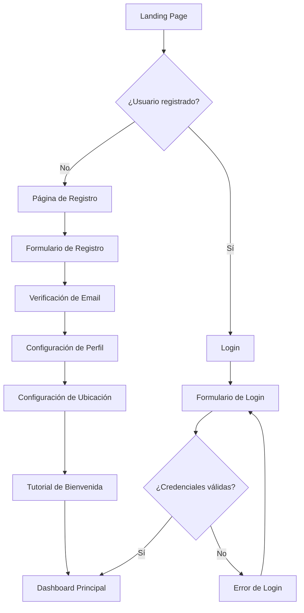

### 2. Flujo de Publicación de Objetos

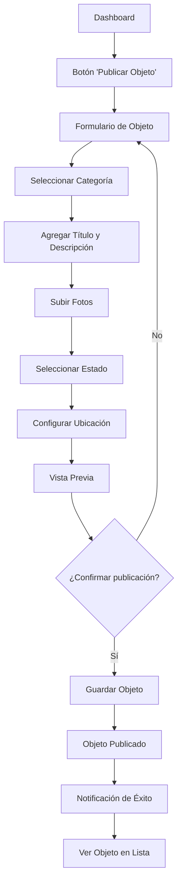

### 3. Flujo de Búsqueda y Exploración

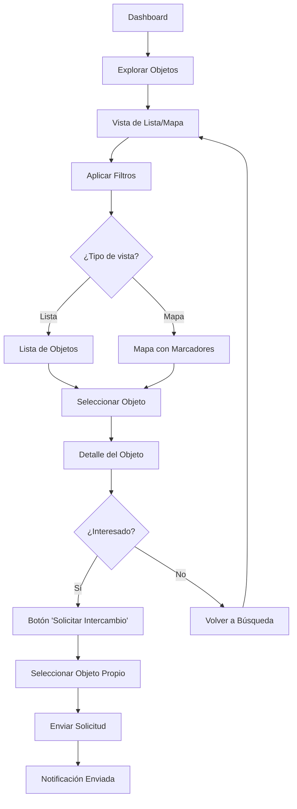

### 3.1. Flujo de Exploración de Eventos ✅ **IMPLEMENTADO**

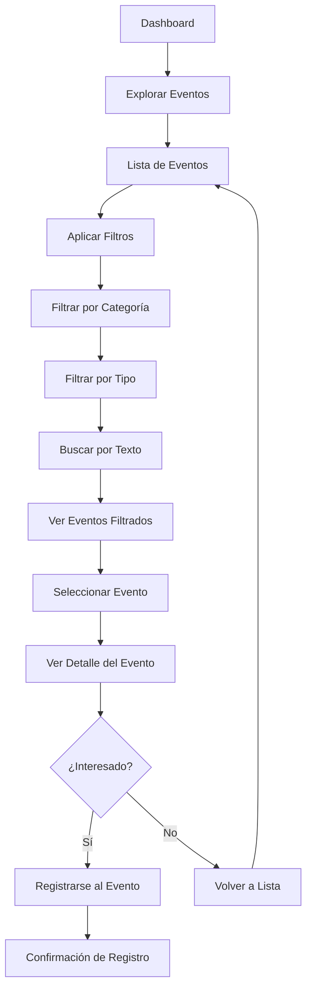

### 3.2. Flujo de Creación de Eventos ✅ **IMPLEMENTADO**

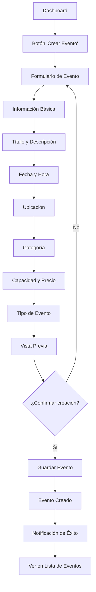

### 4. Flujo de Intercambio Completo

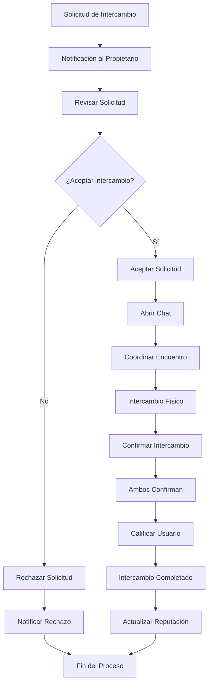

### 5. Flujo de Chat y Comunicación

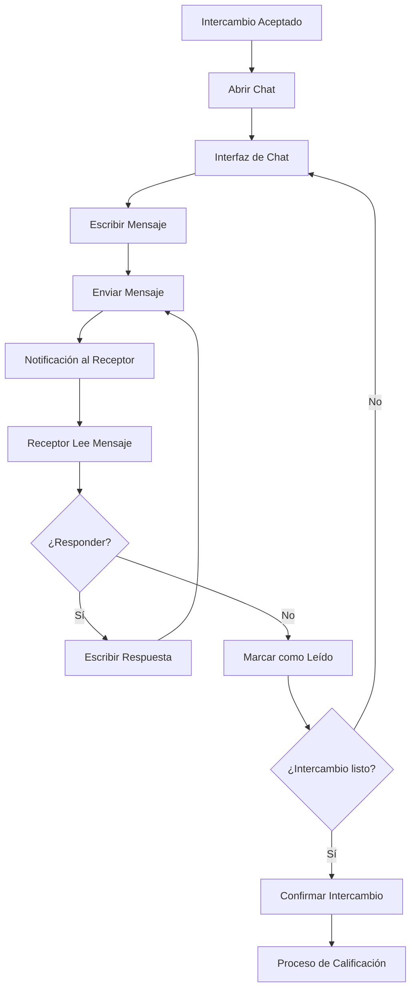

## Flujos Secundarios

### 6. Flujo de Gestión de Perfil

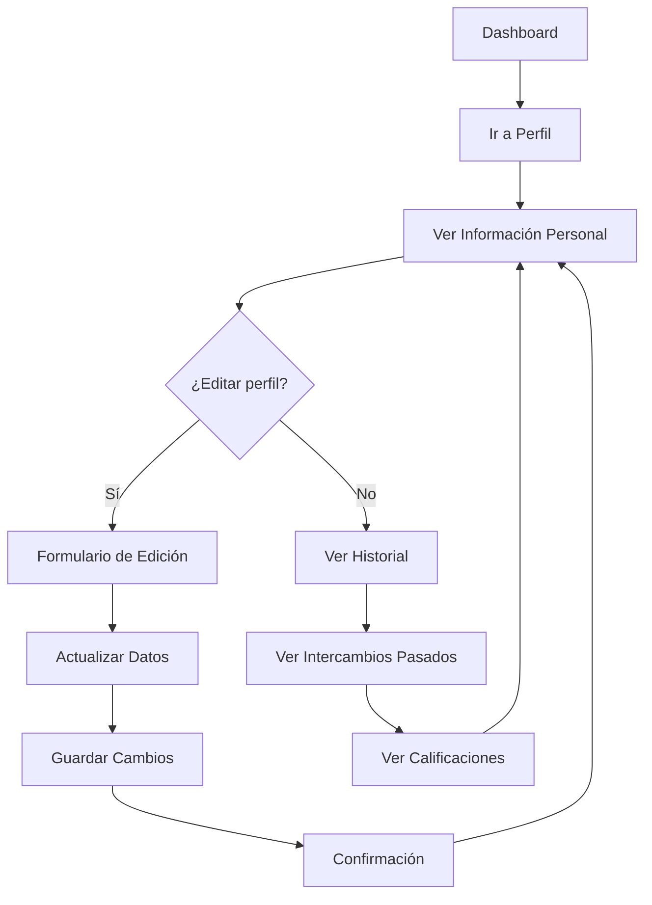

### 7. Flujo de Notificaciones

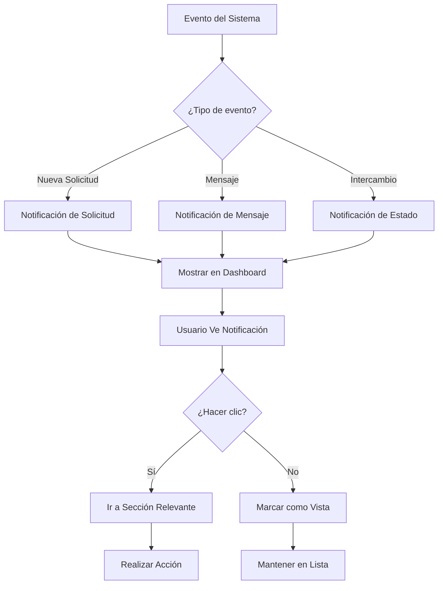

## Estados de los Objetos

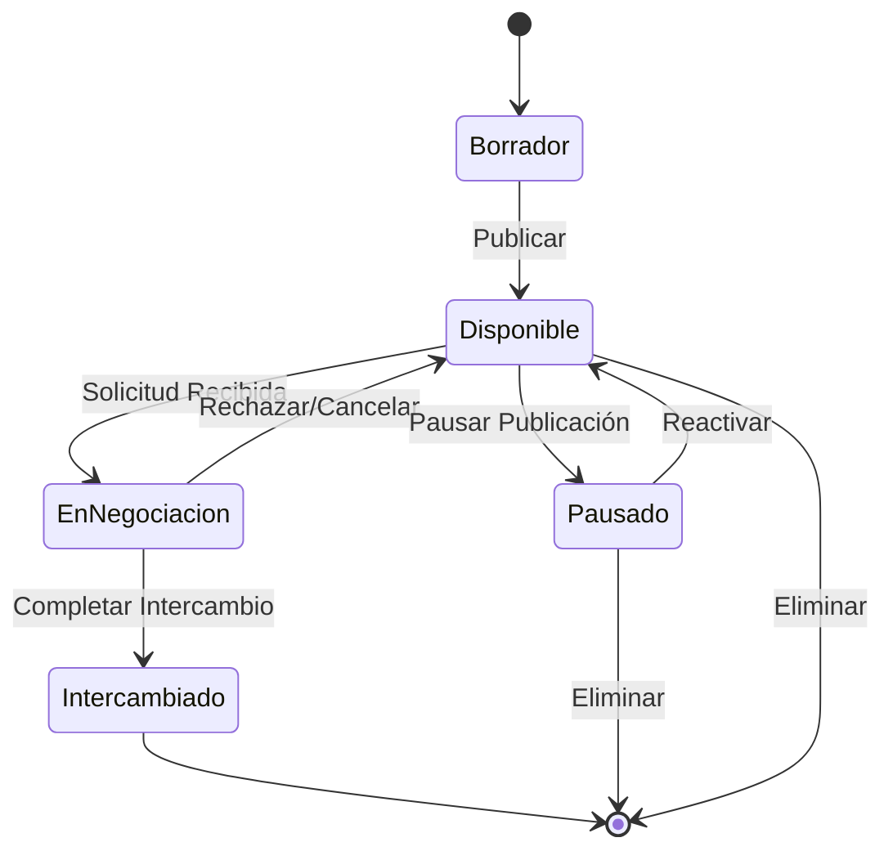

## Estados de los Intercambios

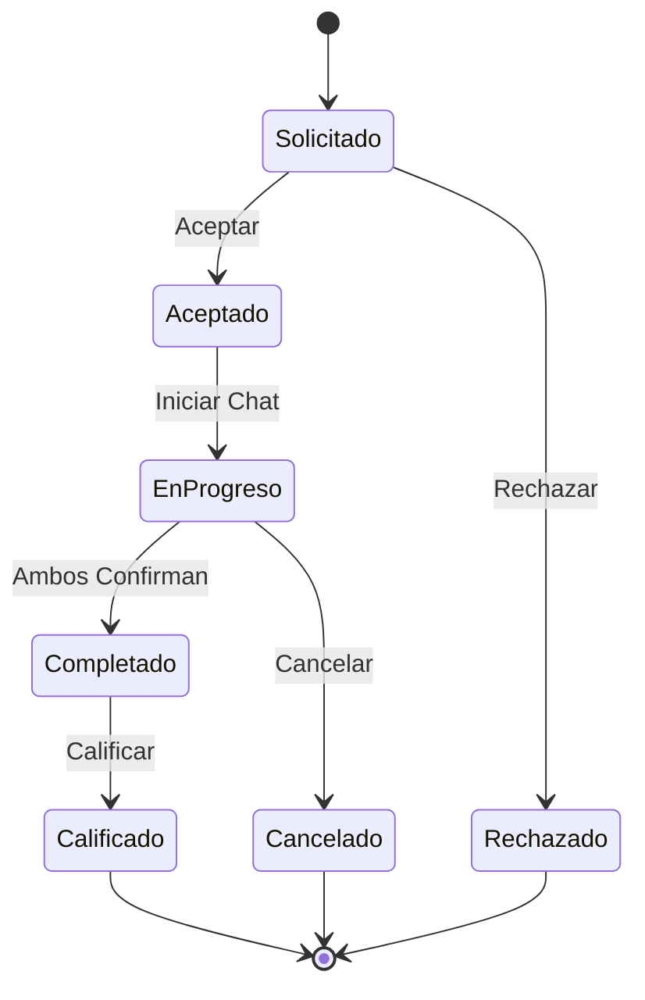

## Flujos de Error y Recuperación

### 8. Flujo de Manejo de Errores

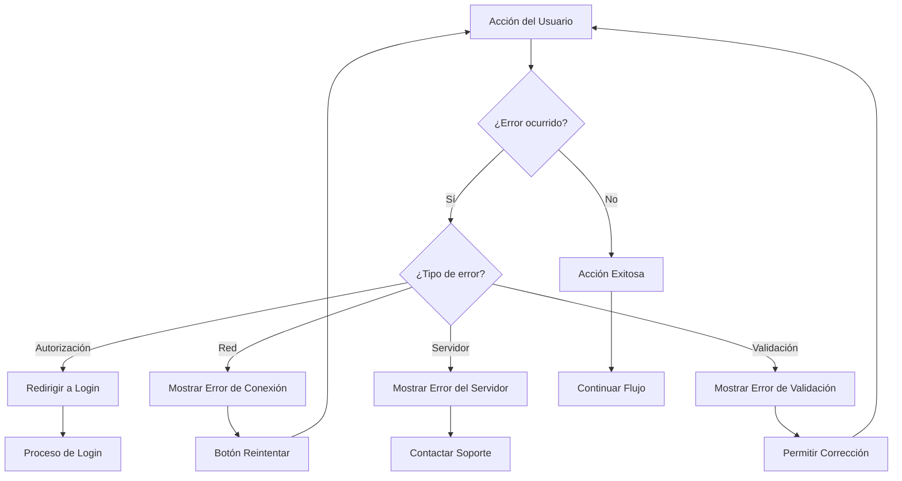

## Navegación Principal

### Estructura de Navegación

```
├── Dashboard (Home)
│   ├── Resumen de actividad
│   ├── Objetos destacados
│   └── Notificaciones recientes
│
├── Explorar
│   ├── Lista de objetos
│   ├── Vista de mapa
│   ├── Filtros y búsqueda
│   └── Eventos ✅ **IMPLEMENTADO**
│       ├── Lista de eventos
│       ├── Filtros por categoría y tipo
│       ├── Búsqueda de eventos
│       └── Crear nuevo evento ✅ **IMPLEMENTADO**
│
├── Mis Objetos
│   ├── Objetos publicados
│   ├── Crear nuevo objeto
│   └── Gestionar publicaciones
│
├── Mis Intercambios
│   ├── Intercambios activos
│   ├── Historial
│   └── Chats
│
├── Perfil
│   ├── Información personal
│   ├── Reputación
│   ├── Configuración
│   └── Historial de actividad
│
└── Notificaciones
    ├── Nuevas solicitudes
    ├── Mensajes
    └── Actualizaciones del sistema
```

## Responsive Design - Flujos Móviles

### Adaptaciones para Móvil

1. **Navegación**: Menú hamburguesa con navegación por pestañas
2. **Búsqueda**: Filtros colapsables y búsqueda por voz
3. **Mapa**: Vista de mapa optimizada para touch
4. **Chat**: Interfaz de chat nativa móvil
5. **Fotos**: Cámara integrada para captura directa
6. **Ubicación**: GPS automático para localización

## Métricas y Analytics por Flujo

### Puntos de Medición

1. **Registro**: Tasa de conversión de landing a registro completo
2. **Publicación**: Tiempo promedio para publicar primer objeto
3. **Búsqueda**: Patrones de búsqueda y filtros más usados
4. **Intercambio**: Tasa de conversión de solicitud a intercambio completado
5. **Retención**: Frecuencia de uso y tiempo en la aplicación

### KPIs por Flujo

- **Onboarding**: % usuarios que completan configuración inicial
- **Publicación**: Promedio de objetos por usuario activo
- **Intercambio**: Tiempo promedio desde solicitud hasta completado
- **Satisfacción**: Calificación promedio de intercambios
- **Engagement**: Sesiones por usuario por semana